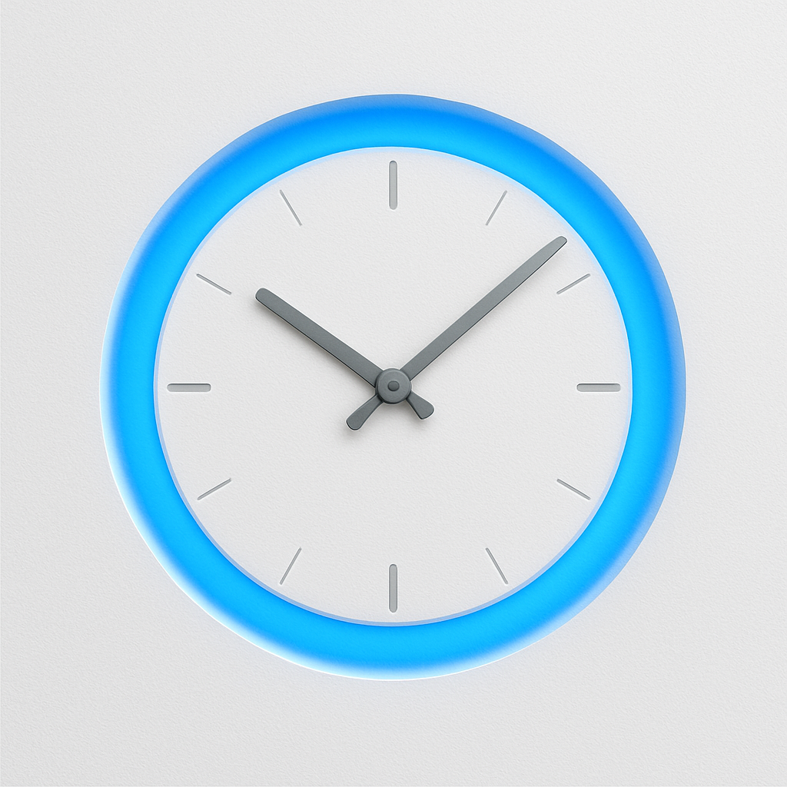

<div align="center">
  

  # UniGlo

  **Schedule and control LED lights on your UniFi access points**

  [](https://www.apple.com/macos)
  [](https://swift.org)
  [](LICENSE)
</div>

---

## Overview

UniGlo is a native macOS application that gives you complete control over the LED lights on your UniFi access points. Whether you want to turn them off at night to avoid light pollution or create custom schedules for different days of the week, UniGlo makes it simple and intuitive.

## Features

### 🎛️ Device Management
- View all UniFi access points in your network
- Real-time online/offline status monitoring
- Individual LED control for each access point
- Bulk actions to turn all LEDs on or off at once

### ⏰ Smart Scheduling
- Create custom schedules with granular time control
- Set different on/off times for each day of the week
- Enable or disable schedules as needed
- Multiple schedules support for complex automation

### 🔐 Secure Authentication
- Secure credential storage using macOS Keychain
- Direct connection to your UniFi Controller
- Support for self-signed certificates
- No third-party services or cloud dependencies

### 🔄 Auto-Updates
- Built-in update mechanism via Sparkle
- Stay up-to-date with the latest features and fixes

## Screenshots

Screenshots are pending for the device list, schedule editor, and settings flow.

## Requirements

- macOS 13.0 (Ventura) or later
- UniFi Controller (self-hosted or Cloud Key)
- Network access to your UniFi Controller

## Installation

### Download Pre-built App
1. Download the latest release from the [Releases](../../releases) page
2. Open the DMG file
3. Drag UniGlo to your Applications folder
4. Launch UniGlo from Applications

### Build from Source
```bash
# Clone the repository
git clone https://github.com/joshferrara/UniGlo.git
cd UniGlo

# Build the application
./build_app.sh

# The app will be built and opened automatically
```

## Usage

### First-Time Setup
1. Launch UniGlo
2. Go to the **Settings** tab
3. Enter your UniFi Controller details:
   - Controller URL (e.g., `https://192.168.1.1:8443`)
   - Username
   - Password
4. Enable **Accept Invalid SSL Certificates** if using a local controller with a self-signed certificate
5. Click **Save & Refresh**

### Managing Devices
1. Navigate to the **Devices** tab
2. Click **Refresh** to load your access points
3. Use the toggle switches to control individual LEDs
4. Use **All On** or **All Off** for bulk control

### Creating Schedules
1. Go to the **Schedules** tab
2. Click **Add Schedule** (or equivalent button)
3. Name your schedule
4. Configure rules for each day:
   - Set ON time (when LEDs should turn on)
   - Set OFF time (when LEDs should turn off)
5. Enable the schedule
6. Save your changes

The scheduler runs in the background and will automatically execute your configured schedules.

## Architecture

UniGlo is built with modern Swift and SwiftUI:

- **SwiftUI**: Native macOS user interface
- **Swift Package Manager**: Dependency management
- **Sparkle**: Automatic update framework
- **Keychain Services**: Secure credential storage
- **URLSession**: Network communication with UniFi Controller
- **JSON files & Keychain Services**: Local settings, schedules, and secure password persistence

### Project Structure
```
UniGlo/
├── Sources/UniFiLEDControllerApp/
│   ├── Views/              # SwiftUI views
│   ├── Networking/         # UniFi API client
│   ├── Scheduling/         # Schedule management
│   ├── Persistence/        # Data storage
│   ├── Sparkle/           # Auto-update integration
│   └── Models.swift       # Data models
├── Tests/                 # Unit tests
└── Package.swift         # SPM configuration
```

## Development

### Prerequisites
- Xcode 15.0 or later
- Swift 5.10 or later

### Building
```bash
# Build with Swift Package Manager
swift build

# Run tests
swift test

# Build distributable app
./build_app.sh
```

### Sparkle Releases

For a GitHub Pages + GitHub Releases Sparkle setup similar to `Hardlinker`, see
[SPARKLE_GITHUB_PAGES_SETUP.md](SPARKLE_GITHUB_PAGES_SETUP.md).

### Contributing
Contributions are welcome! Please feel free to submit a Pull Request.

## Privacy & Security

- **Local-First**: All data is stored locally on your Mac
- **Keychain Integration**: Credentials are securely stored in macOS Keychain
- **No Telemetry**: UniGlo doesn't collect or transmit any usage data
- **Direct Connection**: Communicates directly with your UniFi Controller
- **Open Source**: Full source code available for review

## Known Limitations

- Requires direct network access to UniFi Controller
- Controller must be running UniFi Network Application
- LED control is limited to features exposed by the UniFi API

## Troubleshooting

### Can't Connect to Controller
- Verify your controller URL is correct (include `https://` and port)
- Check that "Accept Self-Signed Certificates" is enabled for local controllers
- Ensure your Mac can reach the controller on the network
- Verify your username and password are correct

### Schedules Not Running
- Check that the schedule is enabled
- Verify the on/off times are set correctly
- Ensure UniGlo is running (it can run in the background)
- Check the system logs for any error messages

### Devices Not Appearing
- Click the **Refresh** button in the Devices tab
- Verify your credentials in Settings
- Ensure your access points are online and adopted

## License

This project is licensed under the MIT License - see the [LICENSE](LICENSE) file for details.

## Acknowledgments

- Built with [Sparkle](https://sparkle-project.org/) for automatic updates
- Inspired by the need for better UniFi LED control
- Thanks to the UniFi community for API documentation

---

<div align="center">
  Made with ❤️ for the UniFi community
</div>
